# Convene v2 — Site & Flow Map

Living reference for the app. Each section below is a self-contained Mermaid
diagram. Keep them short and focused so they stay readable; when a flow grows,
extract it into its own section rather than bloating an existing one.

**Conventions**

- **Page** = `apps/web/src/app/.../page.tsx`
- **API**  = `apps/web/src/app/api/.../route.ts`
- **Dialog** = modal component, typically rendered from `SiteHeader`
- `→` = navigation / redirect, `↔` = bidirectional

**Table of contents**

1. [Route tree](#1-route-tree)
2. [Auth — signup](#2-auth--signup)
3. [Auth — signin & password reset](#3-auth--signin--password-reset)
4. [Learner registration wizard](#4-learner-registration-wizard)
5. [Expert registration (become an expert)](#5-expert-registration-become-an-expert)
6. [Search & discovery](#6-search--discovery)
7. [Booking a session (learner → expert)](#7-booking-a-session-learner--expert)
8. [Stripe payment flow](#8-stripe-payment-flow)
9. [Session lifecycle](#9-session-lifecycle)
10. [Messaging](#10-messaging)
11. [Requests (community marketplace)](#11-requests-community-marketplace)
12. [Freelance](#12-freelance)
13. [Dashboard views](#13-dashboard-views)
14. [Admin surface](#14-admin-surface)
15. [API surface (grouped)](#15-api-surface-grouped)
16. [Database schema overview](#16-database-schema-overview)
17. [DEV tools registry](#17-dev-tools-registry)
18. [Where to look when a specific thing breaks](#18-where-to-look-when-a-specific-thing-breaks)
19. [How to view / edit this file](#19-how-to-view--edit-this-file)

---

## 1. Route tree

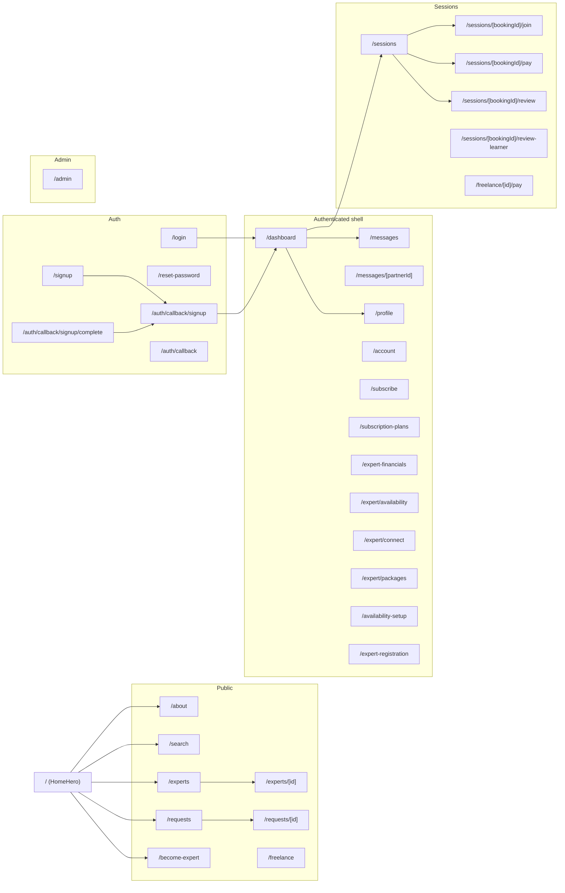

---

## 2. Auth — signup

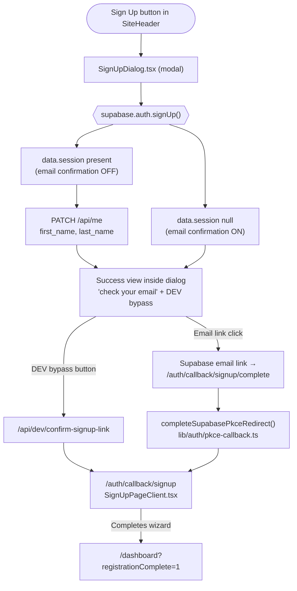

**Key files:** `SignUpDialog.tsx`, `DevEmailConfirmationButton.tsx`,
`lib/auth/post-signup-redirect.ts`, `api/dev/confirm-signup-link/route.ts`,
`app/auth/callback/signup/complete/route.ts`, `SignUpPageClient.tsx`.

---

## 3. Auth — signin & password reset

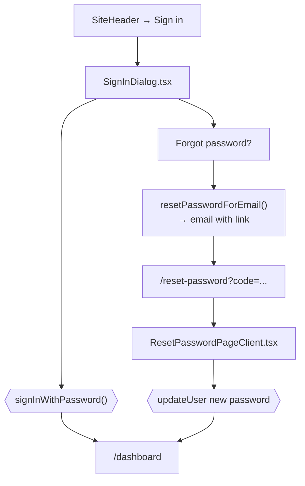

OAuth (Google / Facebook / Apple) from both SignIn and SignUp dialogs goes
through `/auth/callback` (see `app/auth/callback/route.ts`), which calls
`completeSupabasePkceRedirect({ kind: "query_next", defaultPath: "/" })`.

---

## 4. Learner registration wizard

Reached via `/auth/callback/signup`. Single long client component,
`SignUpPageClient.tsx`. One effect loads `/api/me` + session, each step
autosaves to `/api/me` via PATCH.

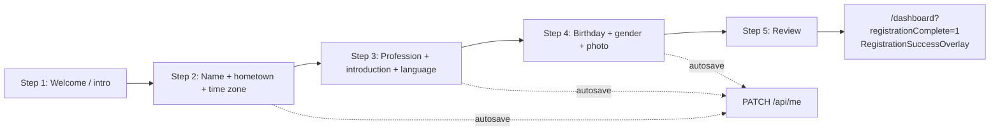

- Google Places autocomplete sets `hometown`; the lat/lng then hits Google
  Maps Timezone API to fill `time_zone`.
- Photo upload goes through `/api/me/profile-photo`.
- Draft state lives server-side in `public.users` directly (no separate
  drafts table for learners).

---

## 5. Expert registration (become an expert)

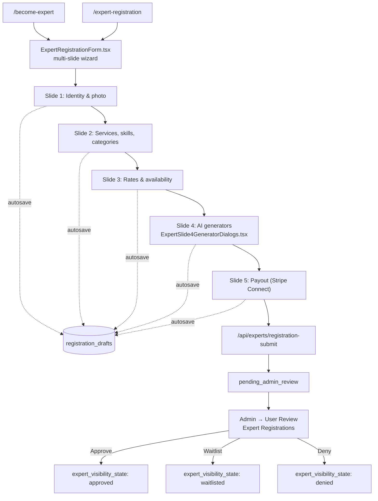

**Key files:** `components/expert/ExpertRegistrationForm.tsx`,
`api/expert-registration/generate/{bio,skills,services,booking-preferences}/route.ts`
(AI assist), `api/experts/registration-draft/route.ts`,
`api/experts/registration-submit/route.ts`,
`api/experts/[id]/approve/route.ts`,
`api/stripe/connect/onboard/route.ts`.

---

## 6. Search & discovery

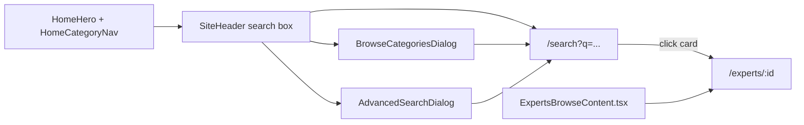

Semantic matching in `lib/searchSemantic.ts`; category grouping in
`lib/searchCategory.ts`. Featured grid rules live in
`lib/featuredExpertsSettings.ts` and the Admin CMS.

---

## 7. Booking a session (learner → expert)

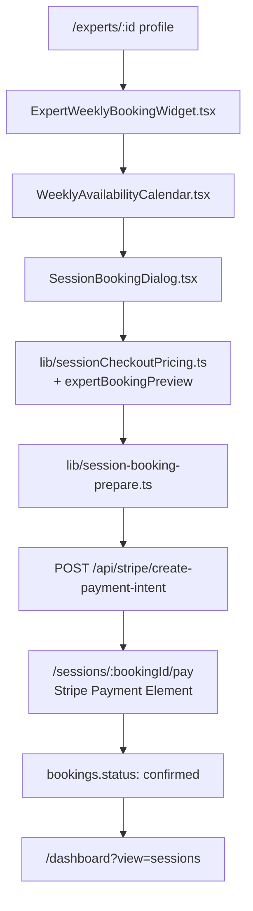

---

## 8. Stripe payment flow

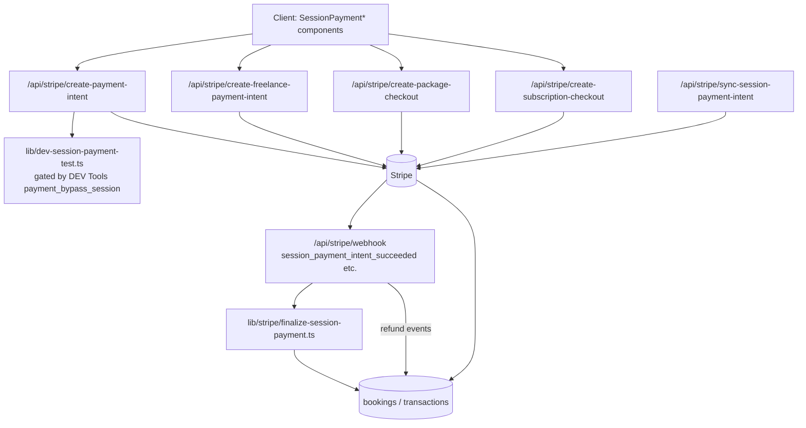

Refunds also originate from Admin Booking Problems:
`/api/admin/bookings/[bookingId]/refund` → `stripe.refunds.create(...)`.

---

## 9. Session lifecycle

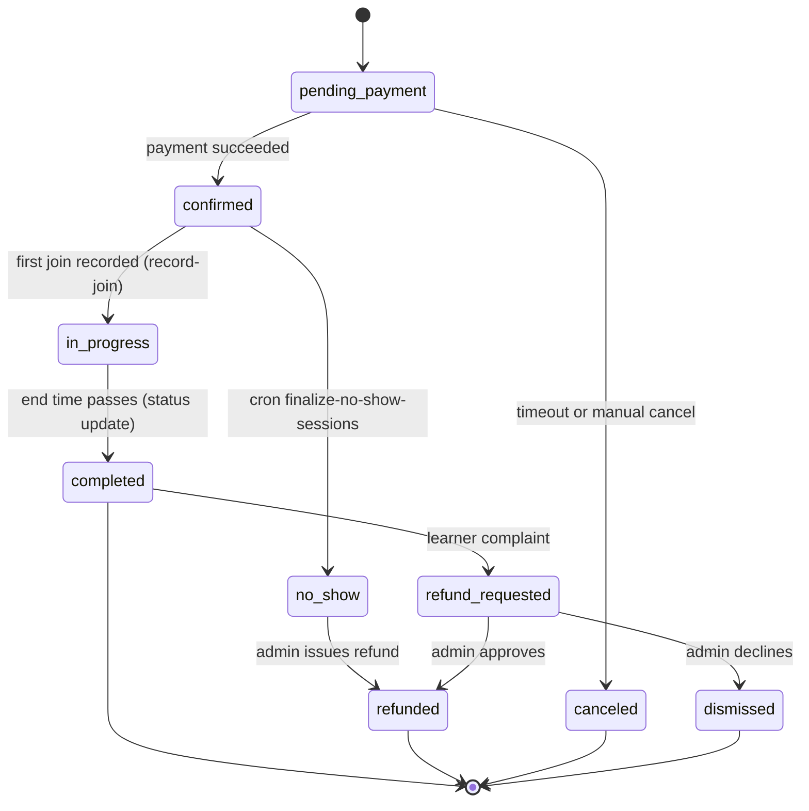

**Join/video:** `/sessions/[bookingId]/join` embeds a room from
`/api/video/ensure-room` and `/api/sessions/[id]/room`. Join event recorded
via `/api/sessions/[id]/record-join`.

---

## 10. Messaging

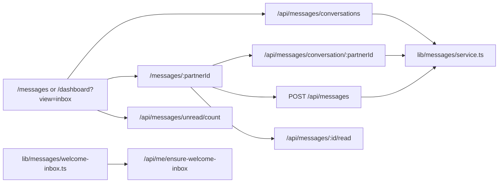

New-user flow: `ensure-welcome-inbox` seeds a DM from the team account
(`CONVENE_TEAM_USER_ID` / `CONVENE_TEAM_EMAIL`). Admin-originated DMs (e.g.,
refund notices) go through `lib/admin/booking-problem-actions.ts`.

---

## 11. Requests (community marketplace)

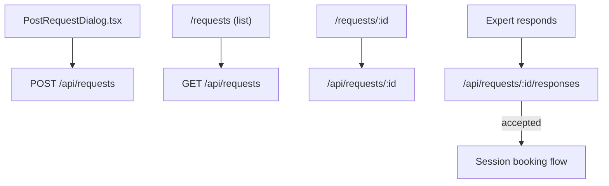

---

## 12. Freelance

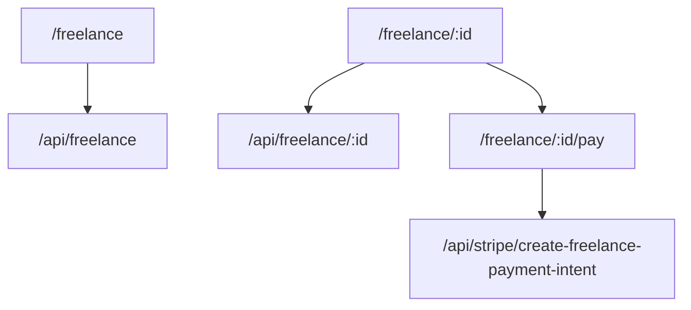

---

## 13. Dashboard views

`/dashboard` uses a single shell (`DashboardClient.tsx`) with a query-param
`view=` controlling which panel is rendered.

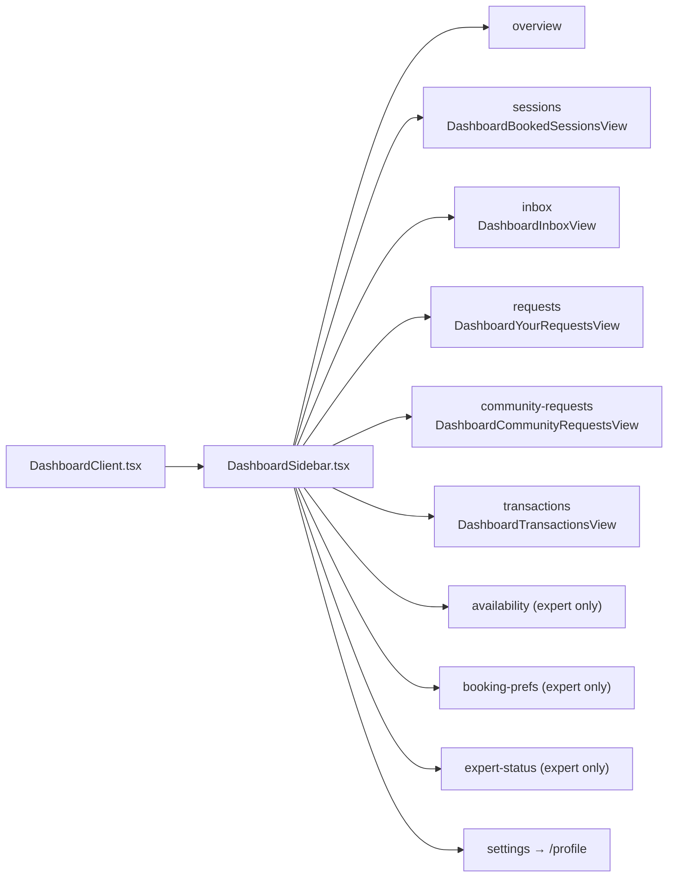

Role mode (learner vs expert) toggles the sidebar. Backed by
`users.convene_role_mode` (see migration `013_add_convene_role_mode.sql`).
Summary numbers + badges come from `/api/me/dashboard-summary`.

---

## 14. Admin surface

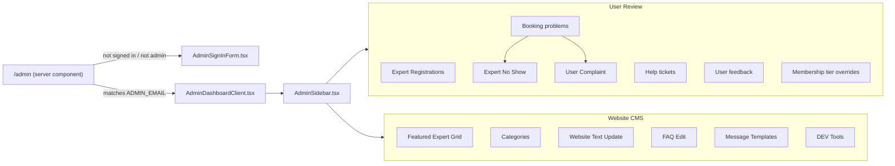

Gating: `ADMIN_EMAIL` in `apps/web/.env.local` + Supabase password login.
No middleware involvement; check happens inside `app/admin/page.tsx`.

---

## 15. API surface (grouped)

```mermaid
flowchart LR
  subgraph Me
    M1["/api/me"]
    M2["/api/me/dashboard-summary"]
    M3["/api/me/profile-photo"]
    M4["/api/me/transactions"]
    M5["/api/me/requests"]
    M6["/api/me/package-credits"]
    M7["/api/me/subscription"]
    M8["/api/me/ensure-welcome-inbox"]
    M9["/api/me/expert-membership-tier"]
  end

  subgraph Experts
    E1["/api/experts"]
    E2["/api/experts/:id"]
    E3["/api/experts/:id/approve"]
    E4["/api/experts/:id/packages"]
    E5["/api/experts/:id/bookings"]
    E6["/api/experts/:id/reviews"]
    E7["/api/experts/:id/first-session-discount"]
    E8["/api/experts/availability"]
    E9["/api/experts/onboard"]
    E10["/api/experts/registration-draft"]
    E11["/api/experts/registration-submit"]
    E12["/api/expert-packages"]
    E13["/api/expert-packages/:id"]
  end

  subgraph SessionsAPI["Sessions"]
    S1["/api/sessions"]
    S2["/api/sessions/:id"]
    S3["/api/sessions/:id/status"]
    S4["/api/sessions/:id/record-join"]
    S5["/api/sessions/:id/room"]
    S6["/api/sessions/:id/reviews/expert"]
    S7["/api/sessions/:id/reviews/learner"]
    S8["/api/sessions/my-sessions"]
  end

  subgraph StripeAPI["Stripe"]
    SP1["/api/stripe/create-payment-intent"]
    SP2["/api/stripe/create-freelance-payment-intent"]
    SP3["/api/stripe/create-package-checkout"]
    SP4["/api/stripe/create-subscription-checkout"]
    SP5["/api/stripe/sync-session-payment-intent"]
    SP6["/api/stripe/customer-portal"]
    SP7["/api/stripe/connect/onboard"]
    SP8["/api/stripe/webhook"]
  end

  subgraph AdminAPI["Admin"]
    A1["/api/admin/summary"]
    A2["/api/admin/check-pending-experts"]
    A3["/api/admin/booking-refund-queue"]
    A4["/api/admin/bookings/:id/refund"]
    A5["/api/admin/bookings/:id/refund-review"]
    A6["/api/admin/experts/membership-tier"]
    A7["/api/admin/featured-experts-settings"]
    A8["/api/admin/categories"]
    A9["/api/admin/categories/icon"]
    A10["/api/admin/site-text"]
    A11["/api/admin/faqs"]
    A12["/api/admin/message-templates"]
    A13["/api/admin/dev-tools"]
    A14["/api/admin/user-feedback"]
    A15["/api/admin/footer-settings"]
    A16["/api/admin/grant-package-credit"]
  end

  subgraph Misc
    MS1["/api/categories"]
    MS2["/api/footer-settings"]
    MS3["/api/messages (and subpaths)"]
    MS4["/api/requests (and subpaths)"]
    MS5["/api/freelance (and subpaths)"]
    MS6["/api/learners/:id (and reviews)"]
    MS7["/api/notifications/check-booking-reminders"]
    MS8["/api/notifications/webhook/message"]
    MS9["/api/cron/finalize-no-show-sessions"]
    MS10["/api/video/ensure-room"]
    MS11["/api/dev-tools/public"]
    MS12["/api/dev/confirm-signup-link"]
    MS13["/api/dev/complete-session-payment-test"]
    MS14["/api/health"]
    MS15["/api/user-feedback/session-issue"]
    MS16["/api/user-feedback/enterprise-inquiry"]
    MS17["/api/user-feedback/expert-category-suggestions"]
  end
```

---

## 16. Database schema overview

High-level only; see `supabase/v2/002_core_schema.sql` and subsequent
migrations for authoritative column definitions.

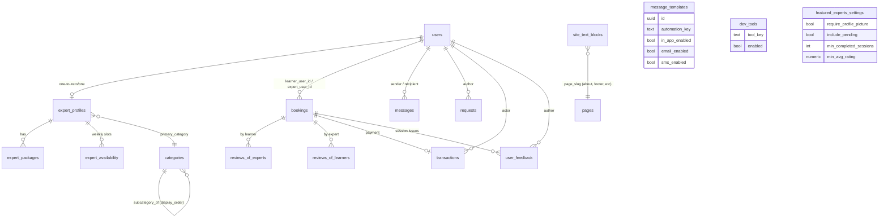

---

## 17. DEV tools registry

Canonical source: `apps/web/src/lib/devTools/registry.ts`. DB state:
`public.dev_tools`. Runtime reads go through `lib/devTools/store.ts`
(server) or `/api/dev-tools/public` (client).

| Key | Default | Used by |
| --- | --- | --- |
| `payment_bypass_session` | `false` | `lib/dev-session-payment-test.ts`, `api/stripe/create-payment-intent`, `api/stripe/create-freelance-payment-intent`, `ExpertRegistrationForm.tsx` payout gate |
| `email_verification_bypass` | `true` | `DevEmailConfirmationButton.tsx` visibility |

Add a new tool: append to the registry, re-read via
`getDevToolsEnabledMap()` (server) or the public API (client), and — optionally
— seed with a migration in `supabase/v2/`.

---

## 18. Where to look when a specific thing breaks

| Symptom | First files to check |
| --- | --- |
| Post-signup success dialog / DEV bypass missing | `SignUpDialog.tsx`, `DevEmailConfirmationButton.tsx`, `DEV Tools → email_verification_bypass` |
| "User already registered" on signup after deleting a learner | Delete from `auth.users` (Supabase Dashboard → Authentication → Users) — `public.users` is a separate row |
| New user lands on homepage instead of wizard | `SignUpDialog.tsx` session branch, `auth/callback/signup/page.tsx`, `SignUpPageClient.tsx` session gate |
| Email confirm link errors (`auth=error`) | `lib/auth/pkce-callback.ts`, Supabase Dashboard → Auth → URL Configuration → Redirect URLs (must include `{ORIGIN}/auth/callback/signup/complete`) |
| Payment intent creation fails in dev | `lib/dev-session-payment-test.ts`, `DEV Tools → payment_bypass_session`, `STRIPE_SECRET_KEY` env, expert payout setup |
| Stripe webhook events missing | `api/stripe/webhook/route.ts`, `lib/stripe/finalize-session-payment.ts`, Stripe CLI listener |
| Admin not loading / wrong account | `ADMIN_EMAIL` in `apps/web/.env.local`, `app/admin/page.tsx`, run `scripts/set-admin-password.mjs` |
| Sidebar badges stuck | `api/admin/summary/route.ts`, `AdminSidebar.tsx`, inspect the related source table (expert_profiles, bookings, user_feedback) |
| Expert not appearing on home grid | `featured_experts_settings` rules, `lib/featuredExpertsSettings.ts`, `require_profile_picture`, expert `visibility_state` |
| Categories missing order/subcats | Migration `031_categories_ordering_and_subcategories.sql`, `api/admin/categories/*` |
| Session doesn't transition to `no_show` | `api/cron/finalize-no-show-sessions`, cron setup in `vercel.json` |
| Welcome message never sent | `lib/messages/welcome-inbox.ts`, `CONVENE_TEAM_USER_ID` / `CONVENE_TEAM_EMAIL` env |
| Hero image stacks below text on narrow screens | `components/home/HomeHero.tsx` grid config |
| Signup disclaimer wrapping to two lines | `SignUpDialog.tsx` disclaimer `<p>` classes |

---

## 19. How to view / edit this file

### In Cursor / VS Code

Both render Mermaid in the Markdown preview, but Cursor's preview requires the
`Markdown Preview Mermaid Support` extension (bierner.markdown-mermaid).
Install it once, then:

- **Preview:** open this file, press `⌘⇧V` (Cmd+Shift+V) to open side preview.
- **Edit with live update:** left pane Markdown source, right pane preview.
- Mermaid blocks that don't render are almost always a syntax error — open
  the block alone in [mermaid.live](https://mermaid.live) to see the parse
  error.

### In a browser (recommended for presentations)

- **GitHub**: push to any branch and view the file — GitHub renders Mermaid
  natively with pan/zoom.
- **mermaid.live**: copy a single ```` ```mermaid ```` block, paste in the
  left editor, get an SVG/PNG export on the right.

### Exporting

- From `mermaid.live`: **Actions → Download SVG / PNG**.
- From the CLI (if you want a full build):
  ```bash
  npx @mermaid-js/mermaid-cli -i docs/SITEMAP.md -o docs/sitemap.svg
  ```

### When to update

Update this doc whenever you:

1. Add a route (new `page.tsx`) or API handler.
2. Introduce a new auth/payment/booking/messaging branch.
3. Change a state machine (session lifecycle, booking statuses, visibility).
4. Add a DEV tool, admin section, or top-level feature.

Treat the "Where to look when a specific thing breaks" table as a running
runbook — every time we debug a regression, add a row.
